# Võ Hưng Yên

  

### System Status // Profile

  Final-year Software Engineering student architecting end-to-end full-stack web, mobile, and AI-assisted systems. Focused on modern backend engineering, concurrent data pipelines, and cloud-native application deployment.

* **Current Focus:** High-concurrency architectures, distributed caching optimization, and automated LLM orchestration.
* **Education:** Software Engineering Student at HUFLIT (Expected Graduation: 2027).
* **Target Position:** Software Engineer Intern / Backend Developer Intern / Full Stack Developer Intern.
* **Deployment Matrix:** [my-portfolio-web-ex66.onrender.com](https://my-portfolio-web-ex66.onrender.com)

---

### Core Architecture // Technology Stack

**Languages & Frameworks**  

**Data, Infrastructure & Cloud Ecosystem**  

---

### Hardened Production Systems // Selected Projects

> **System 01 // ReqSimulator — Requirement Engineering Platform**
> * **Context:** Graduation Thesis | Microservices Architecture
> * **Tech Stack:** ASP.NET Core 9 • FastAPI • PostgreSQL • TypeScript • Gemini AI
> * **Design Engineering:** Engineered a decoupled three-service distributed system. Developed asynchronous communication channels and integrated generative AI orchestration layers to evaluate industry requirement coverage via semantic similarity vectors. Enforced security using JWT validation and granular role-based authorization (RBAC).
> * **Access:** [Live Production Application](https://kltn-chi.vercel.app)

---

> **System 02 // HungYenAirline — Flight Booking Engine**
> * **Context:** Cross-Platform Client Infrastructure
> * **Tech Stack:** ASP.NET Core 8 • SQL Server • Android Native • VNPAY API
> * **Design Engineering:** Applied `RowVersion` optimistic concurrency control directly within the data persistence layer to mitigate multi-user database race conditions during seat allocation. Maintained a shared backend API supporting both responsive web layers and native mobile clients.
> * **Access:** [Web Client Repository](https://github.com/voy32103-code/HungYenAirline_web) | [Android Native Repository](https://github.com/voy32103-code/HungYenAirline-Android)

---

> **System 03 // WebCRM — Enterprise Management Dashboard**
> * **Context:** Full-Stack Internal Workflow Automation
> * **Tech Stack:** React • Node.js • Express.js • PostgreSQL • Gemini AI
> * **Design Engineering:** Formulated clean relational schemas and analytical endpoints. Architected data-dense enterprise dashboards supporting asymmetric Kanban matrices and tabular visualization modules. Integrated context-aware generative pipelines for automated lead scoring.
> * **Access:** [Live Dashboard Presentation](https://webcrm-landing-page.vercel.app) | [Source Code](https://github.com/voy32103-code/WebCRM)

---

> **System 04 // Digital Tech Portfolio & Core Systems**
> * **Context:** Real-time Dynamic Platform
> * **Tech Stack:** ASP.NET Core • PostgreSQL • Redis • SignalR • QuestPDF
> * **Design Engineering:** Integrated Redis distributed caching layers to abstract database load under intensive traffic. Built real-time event broadcasting components via SignalR and handled asynchronous server-side PDF document generation using QuestPDF.
> * **Access:** [Live Application](https://my-portfolio-web-ex66.onrender.com) | [Source Code](https://github.com/voy32103-code/Personal-Dashboard)

---

> **System 05 // HairSalonDuyen Landing Page**
> * **Context:** Responsive Interface & UI Automation
> * **Tech Stack:** React • TailwindCSS • Selenium WebDriver
> * **Design Engineering:** Constructed high-fidelity frontend presentations with structured atomic component reusability. Authored automated end-to-end integration test suites to programmatically validate client UI workflow reliability.
> * **Access:** [Live Presentation](https://hairsalonduyen.vercel.app)

---

### System Telemetry // Metrics

  
  

  

---

### Gateways // Connect

  
  

